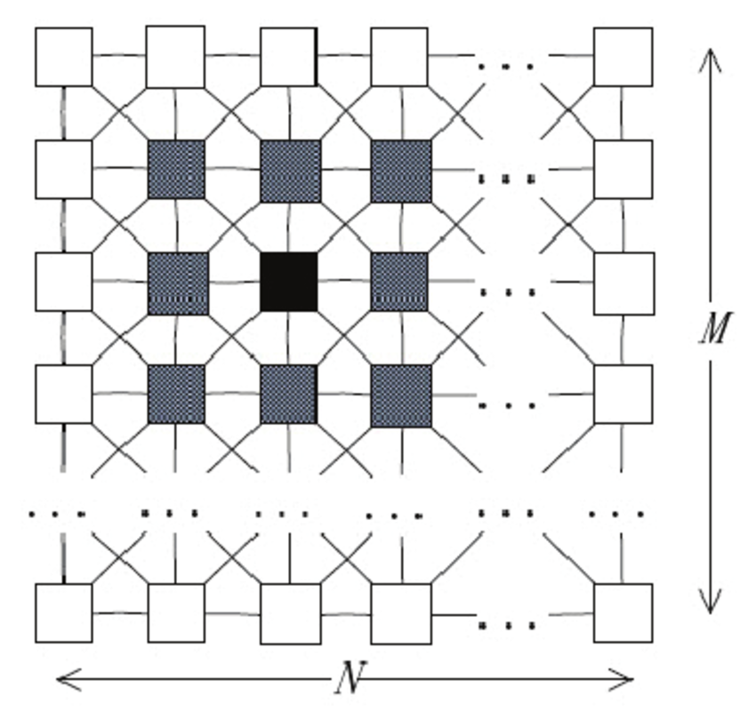

## Cellular Neural Network (CNN) Exploration

We worked with CNNs towards the end of our training when we first arrived in Budapest. We did the introductory exercises that can be found in this directory in order to gain a basic understanding of CNNs. Our supervisor wanted us to have this foundation because later in the summer we worked on creating a CNN friendly Convolutional Neural Network (CoNN) which can be found [here].

## Basic CNN Background

The main difference between Cellular Neural Networks (CNNs) and normal Convolutional Neural Networks (CoNNs) is that all of the operations that occur in CNNs are local operations, meaning that communication is only allowed between neighboring units. CNNs consist of multiple input, single output, nonlinear processing units. An important quality of most CNNs are the 3x3 convolutions that are used. Feel free to browse the [Wikipedia page on CNNs] to find out more information.

[here]: https://github.com/slancas1/budapest_research/tree/master/CNN_friendly_CoNN
[Wikipedia page on CNNs]: https://en.wikipedia.org/wiki/Cellular_neural_network
